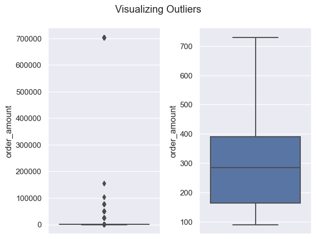

### Question 1: 
Given some sample data, write a program to answer the following: [click here to access the required data set](https://docs.google.com/spreadsheets/d/16i38oonuX1y1g7C_UAmiK9GkY7cS-64DfiDMNiR41LM/edit#gid=0)

On Shopify, we have exactly 100 sneaker shops, and each of these shops sells only one model of shoe. We want to do some analysis of the average order value (AOV). When we look at orders data over a 30 day window, we naively calculate an AOV of $3145.13. Given that we know these shops are selling sneakers, a relatively affordable item, something seems wrong with our analysis. 

Think about what could be going wrong with our calculation. Think about a better way to evaluate this data. 
What metric would you report for this dataset?
What is its value?

#### Answer:
After sorting the data by 'order_amount', it is evident that there are extreme outliers that would skew the mean of the data. The package `seaborn` in python was used to create a boxplot to visualize the outliers:



Given this information, it would be more appropriate to report the median of the data since it is not affected by outliers. This value was found to be $284.00.

All the code used to produce the plot and data above can be found in the 'main.py' file. 


### Question 2:
For this question you’ll need to use SQL. [Follow this link](https://www.w3schools.com/SQL/TRYSQL.ASP?FILENAME=TRYSQL_SELECT_ALL) to access the data set required for the challenge. Please use queries to answer the following questions. Paste your queries along with your final numerical answers below.

a) How many orders were shipped by Speedy Express in total?

```SQL
SELECT COUNT(OrderID) AS NumberOfOrders
FROM Orders
LEFT JOIN Shippers USING(ShipperID)
WHERE ShipperName = 'Speedy Express';
```

Answer: 54 Orders

The number of orders is counted from the 'Orders' table while the shipper name is sourced from the 'Shippers' table.

b) What is the last name of the employee with the most orders?

```SQL
SELECT LastName
FROM Orders
LEFT JOIN Employees USING(EmployeeID)
GROUP BY EmployeeID
ORDER BY COUNT(OrderID) DESC
LIMIT 1;
```

Answer: Peacock

The number of orders is again counted from the 'Orders' table while the last name is sourced from the 'Employees' table.

c) What product was ordered the most by customers in Germany?

```SQL
SELECT ProductName
FROM OrderDetails
LEFT JOIN Products USING(ProductID)
LEFT JOIN Orders USING(OrderID)
LEFT JOIN Customers USING(CustomerID)
WHERE Country = 'Germany'
GROUP BY ProductID
ORDER BY SUM(Quantity) DESC
LIMIT 1;
```

Answer: Boston Crab Meat

The variable 'Quantity' from the table 'OrderDetails' is summed to calculate the total number of products ordered. The variable 'ProductName' from the table 'Products' is used to identify the results by name. The categorical variable 'Country' in the table 'Customers' is required to filter customers from 'Germany'. This data is merged to the order data with the 'Orders' table, since it contains both 'CustomerID' and 'OrderID' data.